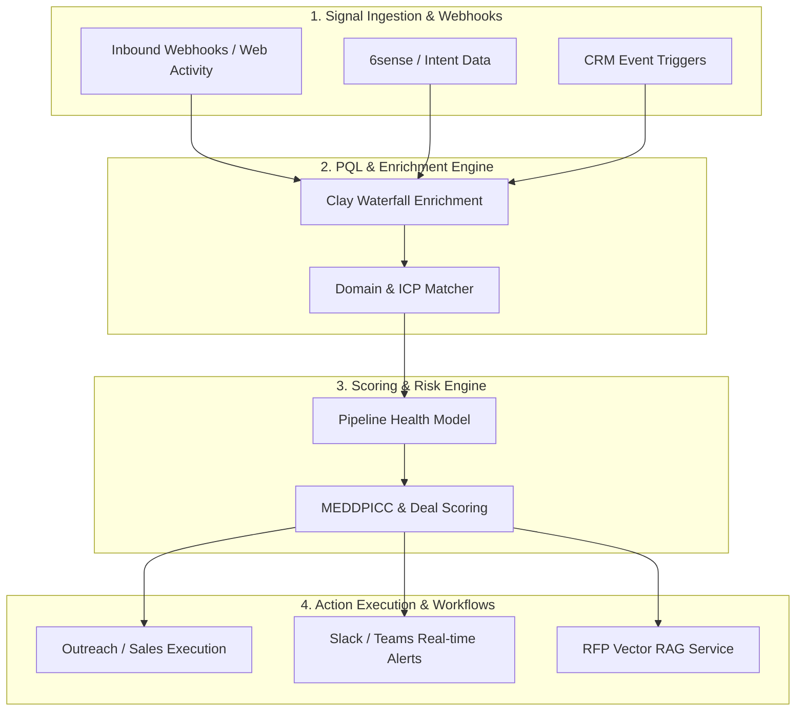

# GTM & RevOps Infrastructure Toolkit

A production-grade toolkit of specifications, Python scoring engines, evaluation frameworks, and workflow automation templates designed for modern GTM Engineering, AI-native revenue operations, and sales ops teams.

---

## 🏗️ Architecture Overview

<details>
<summary><b>View Interactive Mermaid Architecture Diagram</b></summary>



</details>

---

## 🛠️ Module Overview

| Category | Module Directory | Key Capabilities |
| :--- | :--- | :--- |
| **GTM Engineering** | `modules/gtm_engineering/ai_agents/` | Workflow orchestration, Clay enrichments, API tool calling |
| **Deal Scoring** | `modules/gtm_engineering/deal_scoring/` | Algorithmic deal-risk & pipeline-health evaluation (`pipeline_health_model.py`) |
| **AI Evals & Guardrails** | `modules/gtm_engineering/evaluation_guardrails/` | Observability, data privacy, and Human-in-the-Loop (HITL) specs |
| **RFP Automation** | `modules/gtm_engineering/rfp_automation/` | Vector retrieval architecture for automated security & technical RFPs |
| **SalesOps & Planning** | `modules/salesops/capacity_planning/` | Funnel modeling, capacity planning, and headcount performance tracking |

---

## 📂 Directory Architecture

```text
gtm-revops-toolkit/
├── modules/
│   ├── gtm_engineering/
│   │   ├── ai_agents/
│   │   │   └── agent_orchestration_spec.md
│   │   ├── deal_scoring/
│   │   │   └── pipeline_health_model.py
│   │   ├── evaluation_guardrails/
│   │   │   └── ai_eval_framework.md
│   │   └── rfp_automation/
│   │       └── rfp_pipeline_spec.md
│   └── salesops/
│       └── capacity_planning/
└── templates/
    └── architecture_diagrams/
        └── gtm_revops_architecture.png
```

---

## 🧠 Prompt & Agent Library

A 53-agent + 11-sub-agent prompt library organized by Function -> Purpose -> Priority, with 4 bounded-autonomy Workflow Contracts and a proof-of-concept MCP automation server -- built and governed per `CLAUDE.md`.

- **Start here:** [`gtm-os/agents/00-Agent-Router.md`](gtm-os/agents/00-Agent-Router.md) -- routing table from plain-language request to agent/sub-agent
- **Full taxonomy:** [`wiki/concepts/full-org-agent-taxonomy.md`](wiki/concepts/full-org-agent-taxonomy.md)
- **Skills:** [`wiki/skills/`](wiki/skills/) -- role-competency notes (SDR, AE, CS, RevOps, GTM leadership)
- **Tool intelligence:** [`wiki/competitive/`](wiki/competitive/) -- 27 tool profiles + friction/objection heatmaps
- **Workflow Contracts:** [`gtm-os/contracts/`](gtm-os/contracts/) -- `pipeline-risk`, `inbound-lead-qualifier`, `speed-to-lead-sla`, `casl-compliance-gate`
- **Automation:** [`gtm-os/mcp/00-Automation-Layer-Index.md`](gtm-os/mcp/00-Automation-Layer-Index.md) -- 1 contract has a working MCP proof-of-concept, 3 pending
- **Latest audit:** [`Audits/Audit_2026-09-25_Vault_Health.md`](Audits/Audit_2026-09-25_Vault_Health.md)

## 🚀 Getting Started

```bash
# Clone repository
git clone https://github.com/peytonbackus-spec/gtm-revops-toolkit.git
cd gtm-revops-toolkit

# Run deal health scoring model example
python3 modules/gtm_engineering/deal_scoring/pipeline_health_model.py
```
