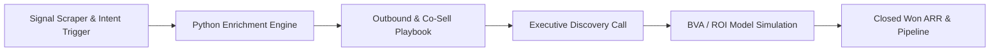

# Enterprise Go-To-Market & RevOps Engineering Toolkit

A production-ready, company-agnostic Go-To-Market (GTM) engine and Revenue Operations architecture. Designed for rapid deployment across high-yield B2B SaaS, industrial tech, and fintech organizations.

---

### Master GTM Operating System Flow

---

### Master Architecture Contents

| Category | Component | Functional Scope |
| :--- | :--- | :--- |
| **GTM Strategy** | `01_ICP_and_Segmentation_Framework.md` | Target account selection, buyer personas, and signal scoring |
| **Sales Execution** | `02_Executive_Outbound_Playbooks.md` | Signal-led scripts, discovery maps, and objection handling |
| **Automation & Code**| `03_Signal_Enrichment_Engine.py` | Python prototypes for Clay automations & signal parsing |
| **Financial Engineering**| `04_CFO_BVA_and_ROI_Calculator.py` | Payback period models, downtime cost, and unit economics |
| **RevOps & Systems** | `05_Salesforce_Data_Model_and_Pipeline.md` | Custom object schemas, stage exit criteria, & metrics |
| **Template Guide** | `VARIABLES.md` | Universal variable substitution guide for client adaptation |

---

### Variable Customization

This repo uses modular variable tags (e.g., `[COMPANY_NAME]`, `[TARGET_BUYER_PERSONA]`). Refer to `VARIABLES.md` to adapt this toolkit for specific executive interviews, client proposals, or advisory engagements.
