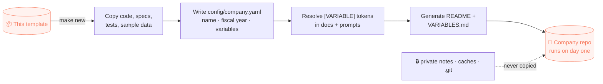

# GTM & RevOps Toolkit

**One revenue engine, two owners, any company.** A config-driven toolkit for running the whole revenue lifecycle: the lead side (GTM Engineer), the pipeline-to-renewal side (GTM Strategy & Ops), and the shared foundation both depend on. It is also a **template**: one command turns it into a ready-to-run repo for a specific company.


> All accounts, people and numbers in `sample_data/` are synthetic. Every company-specific value lives in [`config/example.yaml`](config/example.yaml), and every working assumption is tagged `[ASSUME]`. Nothing company-specific is hardcoded in code.

---

## How to read this repo

Every folder, badge and diagram node is colour-coded by the role it supports:

| Colour | Folder | Owns the revenue lifecycle from… |
|---|---|---|
| 🟦 **Blue** | [`gtm_engineer/`](gtm_engineer/) | first signal → enrichment → score → route → AI research → SQL |
| 🟩 **Green** | [`gtm_strategy_ops/`](gtm_strategy_ops/) | opportunity → stage gates → deal risk → forecast → close → renewal |
| 🟪 **Purple** | [`shared_core/`](shared_core/) | CRM data model, data quality, AI governance, metric definitions, config |

**Start here:** [`docs/overview/`](docs/overview/README.md) for architecture, decisions and glossary, then the two track READMEs.


```mermaid
flowchart LR
    subgraph ENG["🟦 GTM Engineer"]
        direction LR
        S[Signals<br/>intent · chat · social] --> E[Enrich<br/>waterfall + L2A match] --> SC[Score<br/>Fit × Intent] --> RT[Route<br/>R1–R7] --> AI1[AI research<br/>brief] --> CD[Cadence<br/>sequencer + dialer]
    end
    subgraph OPS["🟩 GTM Strategy & Ops"]
        direction LR
        O[Opportunity<br/>stage gates] --> DR[Deal risk<br/>+ AI commentary] --> FC[Forecast<br/>+ accuracy] --> CW[Close] --> RN[Renewal health<br/>+ AI brief]
        RN -->|expansion| O
    end
    subgraph SH["🟪 Shared Core"]
        direction LR
        CFG[/config YAML/] --- DM[(CRM<br/>data model)] --- DQ[Data-quality<br/>monitor] --- GOV[AI governance<br/>PII · evals · HITL] --- MET[Metric<br/>definitions + SQL]
    end
    CD --> H{{Lead → Opportunity<br/>handoff}} --> O
    SH -.-> ENG
    SH -.-> OPS
    classDef eng fill:#1F6FEB1A,stroke:#1F6FEB,color:#1F6FEB;
    classDef ops fill:#2DA44E1A,stroke:#2DA44E,color:#2DA44E;
    classDef sh fill:#7B61FF1A,stroke:#7B61FF,color:#7B61FF;
    class S,E,SC,RT,AI1,CD eng;
    class O,DR,FC,CW,RN ops;
    class CFG,DM,DQ,GOV,MET sh;
```

## The two tracks at a glance

| | 🟦 GTM Engineer | 🟩 GTM Strategy & Ops |
|---|---|---|
| **Core question** | Are we creating enough *qualified* pipeline, efficiently? | Will we hit the number, and keep what we've won? |
| **Primary objects** | Lead, Campaign, Account (matching) | Opportunity, Forecast, Renewal |
| **AI workflows** | Account research, enrichment, qualification, routing | Deal-risk detection, forecast commentary, renewal signals |
| **Key systems** (`[VARIABLES]`) | Data provider, enrichment orchestration, website chat, sequencer, dialer, social selling | Forecasting tool, conversation intelligence |
| **Shared systems** | CRM · warehouse/BI · AI governance | CRM · warehouse/BI · AI governance |
| **Headline metrics** | Lead→opp conversion, speed-to-lead, pipeline per lead, scoring lift | Coverage, forecast accuracy and bias, win rate, GRR/NRR |
| **Partners with** | Marketing, SDR leadership, AEs | Sales leadership, Finance, Customer Success |
| **Track overview** | [`gtm_engineer/README.md`](gtm_engineer/README.md) | [`gtm_strategy_ops/README.md`](gtm_strategy_ops/README.md) |
| **First 90 days** | [plan](gtm_engineer/first-90-days.md) | [plan](gtm_strategy_ops/first-90-days.md) |

## Spin up a company repo

This repo is the source of truth. Each company gets its own copy, generated, not hand-edited:

```bash
make new COMPANY="Acme Corp" FY_START=1          # or: python scripts/new_company.py "Acme Corp" --dest ~/work/acme-gtm
```


```mermaid
flowchart LR
    T[(📦 This template)] -->|make new| C[Copy code, specs,<br/>tests, sample data]
    C --> Y[Write config/company.yaml<br/>name · fiscal year · variables]
    Y --> V["Resolve [VARIABLE] tokens<br/>in docs + prompts"]
    V --> R[Generate README +<br/>VARIABLES.md]
    R --> N[(🏢 Company repo<br/>runs on day one)]
    X[🔒 private notes · caches · .git] -. never copied .-> N
    classDef t fill:#F781661A,stroke:#F78166,color:#F78166;
    class T,N t;
```

The generated repo runs `make data demo test` immediately. Then you replace example segments, personas, stack and quota with sourced facts. Full walkthrough: [`docs/overview/new-company-repo.md`](docs/overview/new-company-repo.md).

## What runs

Everything runs offline against synthetic data. No API keys needed. AI workflows use a deterministic mock model by default; the same prompts run live with `GTM_LLM_MODE=anthropic`.

```bash
pip install -r requirements.txt
make data        # regenerate sample_data/ from config (seeded, reproducible)
make demo        # run every report in both tracks
make test        # unit tests + prompt evals + scaffold test (also in CI)
```

| Module | Role | What you see |
|---|---|---|
| `shared_core.data_quality.dq_monitor` | 🟪 | 16 rules, pass rate per rule, failing records routed to an owner |
| `gtm_engineer.lead_scoring.score_leads` | 🟦 | A1–D4 grade grid; top leads with recommended action |
| `gtm_engineer.lead_scoring.calibrate_scoring` | 🟦 | Does the score predict conversion? Monotonic check; weight suggestions |
| `gtm_engineer.lead_routing.route_leads` | 🟦 | R1–R7 routing decisions, each with a reason; SDR load balancing |
| `gtm_engineer.lead_lifecycle.lifecycle_sla` | 🟦 | MQL→SAL SLA by SDR and source; stuck leads |
| `gtm_engineer.funnel_analytics.funnel_report` | 🟦 | Cohort funnel, velocity, penetration, early-pipeline outlook, narrative |
| `gtm_engineer.sdr_capacity.capacity_model` | 🟦 | SDRs needed to source a pipeline target, with sensitivity |
| `gtm_engineer.ai_research.account_research` | 🟦 | AI pre-call briefs → HITL review queue + audit log |
| `gtm_strategy_ops.pipeline_analytics.pipeline_report` | 🟩 | Coverage vs quota, pipeline by region/product/source/owner, aging, narrative |
| `gtm_strategy_ops.forecasting.forecast_accuracy` | 🟩 | Week 4/8/12 commit accuracy, bias by region, adjustment factor |
| `gtm_strategy_ops.ai_deal_risk.deal_risk` | 🟩 | Risk signals → AI deal and region commentary → HITL queue |
| `gtm_strategy_ops.renewals.renewal_signals` | 🟩 | Renewal health by product line, forecast GRR, expansion signals |
| `gtm_strategy_ops.renewals.closed_lost_analysis` | 🟩 | Loss reasons → owner actions; competitor losses |
| `make webhook` | 🟦 | FastAPI enrichment webhook: rules-engine waterfall + lead-to-account matcher |
| `gtm_engineer.marketing_ops.campaign_report` | 🟦 | Channel funnel and ROI, W-shaped attribution, campaign and consent hygiene (with Marketing Ops) |
| `gtm_engineer.marketing_ops.demand_plan` | 🟦 | Reverse funnel: bookings plan → pipeline → opps by source → leads and MQLs by channel vs run rate |
| **`gtm_strategy_ops.sales_leadership.vp_brief`** | 🟩 | **VP of Sales brief: snapshot (one phone screen) or full; the number, reps, industries, bottlenecks, hot and at-risk deals, asks** |
| `gtm_strategy_ops.sales_leadership.stage_velocity` | 🟩 | Where deals slow and where they die, by stage, with the drivers (owner, source, segment, EB access) and the fix to test |
| `gtm_strategy_ops.sales_leadership.all_hands` | 🟩 | Sales all-hands inputs: the number, wins, recognition, good and bad, lessons, focus, speaker prompts |
| `gtm_strategy_ops.sales_planning.*` | 🟩 | AE capacity and hiring plan, quota vs capacity, territory carve and balance, pipeline distribution, CRM request triage |

## One config drives everything

[`config/example.yaml`](config/example.yaml) is the single place a company is described. Code, SQL, prompts and sample data all read from it:

| Config block | Drives |
|---|---|
| `fiscal` | Fiscal quarter labels in Python **and** SQL (`{{FY_START_MONTH}}`), tested for parity |
| `segments`, `personas` | Fit scoring, routing pods, AI research angles, sample-data generation |
| `lead_scoring` | Fit/intent bands, size and region points, alignment rules, signal decay |
| `lead_routing` | Ordered pods, SDR roster, partner manager, load caps |
| `opportunity` | Stages, probabilities, stage time limits, loss reasons, coverage target |
| `renewals`, `quota` | Health weights, lookahead window, quota by quarter and region |
| `sales_team`, `sales_planning` | AE roster and ramp, productivity, attrition, bookings plan, territory and distribution limits, request SLAs |
| `sales_leadership` | Win-rate sample size, hot and slipping deal rules, all-hands recognition |
| `marketing_ops` | Campaign naming, member statuses, UTM lists, attribution model, consent regions, demand-plan source mix |
| `stack`, `variables` | Tool names resolved into every doc and prompt as `[CRM]`, `[FORECAST_TOOL]`… |

Config resolution order: `$GTM_CONFIG` → `config/company.yaml` → `config/example.yaml`.

## AI governance, built in

Every AI workflow follows the same standard in [`shared_core/ai_governance/`](shared_core/ai_governance/README.md):

- **PII guard**: fields not on an allow-list are dropped and free text is redacted before any model call.
- **Output contracts**: responses missing required keys are rejected, not patched.
- **Human in the loop**: low-confidence or high-impact outputs go to a review queue; nothing writes to a record unreviewed.
- **Evals**: each prompt ships with test cases (`*/evals/*.json`) that run in CI.
- **Audit log**: every call is logged with inputs, outputs and decision.

## Repository map

```
config/                      🟪 example.yaml (the one config) + enrichment waterfall rules
shared_core/                 🟪 BOTH ROLES
  config.py, schemas.py         config loader, fiscal calendar, shared data models
  context/                      ICP & personas, GTM stack map
  data_model/                   CRM objects & fields, with the Lead→Opp handoff boundary
  data_quality/                 dq_monitor.py
  ai_governance/                PII guard, LLM client, eval harness, HITL
  metrics/                      metric definitions + semantic-layer SQL + attribution SQL
gtm_engineer/                🟦 GTM ENGINEER
  lead_lifecycle/               lifecycle spec (statuses, SLAs) + SLA monitor
  lead_scoring/                 fit × intent scoring + calibration against outcomes
  lead_routing/                 routing engine + CRM flow spec
  enrichment/                   rules-engine waterfall + lead-to-account matcher
  integrations/                 FastAPI enrichment webhook
  ai_research/                  AI account research (prompt, evals, HITL)
  platform_admin/               enrichment waterfall + engagement-layer config
  funnel_analytics/             funnel report, SQL, dashboard spec
  sdr_capacity/                 capacity model
  marketing_ops/                campaign ops spec, attribution + hygiene report, demand plan, RACI with Marketing Ops
gtm_strategy_ops/            🟩 GTM STRATEGY & OPS
  opportunity_lifecycle/        stage definitions & exit criteria
  forecasting/                  forecast cadence + accuracy/bias measurement
  forecast_tool_admin/          forecast-tool configuration + CRM integration spec
  pipeline_analytics/           pipeline report, SQL, dashboards
  ai_deal_risk/                 deal-risk signals + AI commentary (prompts, evals)
  renewals/                     renewal process, health signals, closed-lost & churn
  partner_ops/                  partner-sourced opportunity workflow
  sales_leadership/             VP of Sales brief, rep scorecard, industries, stage velocity, deal board, all-hands inputs
  sales_planning/               capacity, quota, territory, pipeline distribution, CRM request intake
prototypes/                     earlier standalone engines: MEDDPICC health, churn, PQL, tech debt
docs/                           overview, specs, playbooks, worked examples
sample_data/                    synthetic data (generated by scripts/generate_sample_data.py)
scripts/                        sample-data generator + new_company.py scaffold
tests/                          unit tests, prompt evals, scaffold test
```

## Supporting docs

- [`docs/overview/`](docs/overview/README.md): architecture, running the toolkit, decision log, glossary, roadmap
- [`docs/overview/new-company-repo.md`](docs/overview/new-company-repo.md): creating a company repo from this template
- [`docs/specs/`](docs/specs/) · [`docs/playbooks/`](docs/playbooks/) · [`docs/examples/`](docs/examples/): CRM architecture, lead management, MEDDPICC, forecasting, territory and health-scoring playbooks
- [Sales leadership reporting](gtm_strategy_ops/sales_leadership/README.md): what the VP of Sales asks and how each answer is built, plus [intake questions](gtm_strategy_ops/sales_leadership/vp-intake.md) for the first 1:1
- [Sales planning](gtm_strategy_ops/sales_planning/README.md): capacity, quota, territory, pipeline distribution and [CRM request intake](gtm_strategy_ops/sales_planning/crm-request-intake.md)
- [Marketing Ops](gtm_engineer/marketing_ops/README.md): who owns what between Marketing Ops and RevOps, the [campaign operations spec](gtm_engineer/marketing_ops/campaign-operations-spec.md) and the demand plan
- [`VARIABLES.md`](VARIABLES.md): every `[VARIABLE]` token and what it means
- [`docs/SKILL_MATRIX.md`](docs/SKILL_MATRIX.md): capabilities covered, by area
- [`CONTRIBUTING.md`](CONTRIBUTING.md) · [`CHANGELOG.md`](CHANGELOG.md)

## Principles

Synthetic data only. Assumptions are tagged until sourced. Humans approve AI output before it touches a record. Strategy, financials, prospect lists and client notes never live here.

MIT licensed.
