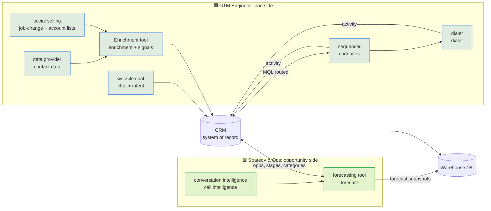

# GTM Stack Map

Every tool in the stack, what it is the system of record for, and which role administers it. The CRM ([CRM]) is the hub. Nothing writes around it. Tool names resolve from `stack:` and `variables:` in the company config.

| Tool | System of record for | Primary admin |
|---|---|---|
| **[CRM]** | Leads, accounts, contacts, opportunities, activities | Shared: GTM Eng owns Lead and Campaign objects plus routing; Strategy & Ops owns Opportunity, forecast fields and renewals |
| **[FORECAST_TOOL]** | Forecast submissions, forecast categories, pipeline snapshots | 🟩 Strategy & Ops |
| **[CONVERSATION_INTELLIGENCE]** | Call recordings and deal-level conversation signals | 🟩 Strategy & Ops |
| **[SEQUENCER]** | Cadences and email/call activity | 🟦 GTM Engineer |
| **[DIALER]** | Parallel dialing and call outcomes | 🟦 GTM Engineer |
| **[ENRICHMENT_ORCHESTRATION]** | Enrichment waterfalls, signal detection, AI research columns | 🟦 GTM Engineer |
| **[DATA_PROVIDER]** | Contact emails and direct dials | 🟦 GTM Engineer |
| **[WEBSITE_CHAT]** | Website chat, intent, meeting booking | 🟦 GTM Engineer |
| **[SOCIAL_SELLING]** | Account and lead lists, job-change alerts | 🟦 GTM Engineer |

> **Vendor note:** if the sequencer and the forecasting tool share a vendor or a data layer, activity logged by 🟦 shows up in 🟩 forecast signals. Both roles then need one activity-capture standard. See the [forecasting-tool spec](../../gtm_strategy_ops/forecast_tool_admin/forecast-tool-configuration-spec.md).

## Integration rules

1. **The CRM wins conflicts.** The enrichment tool writes only to fields with a suffixed name or to empty fields, never over a rep-entered value. See the [object model](../data_model/salesforce-object-model.md).
2. **One owner per field.** Every custom field has an owning role in the object model. If a field has two writers, that's a bug to fix.
3. **Activity flows one way.** [SEQUENCER] and [DIALER] log to the CRM. [FORECAST_TOOL] reads from the CRM. No tool reads activity from another tool directly.
4. **AI writes go through review.** No model output updates a CRM field without the [HITL policy](../ai_governance/hitl.py).
